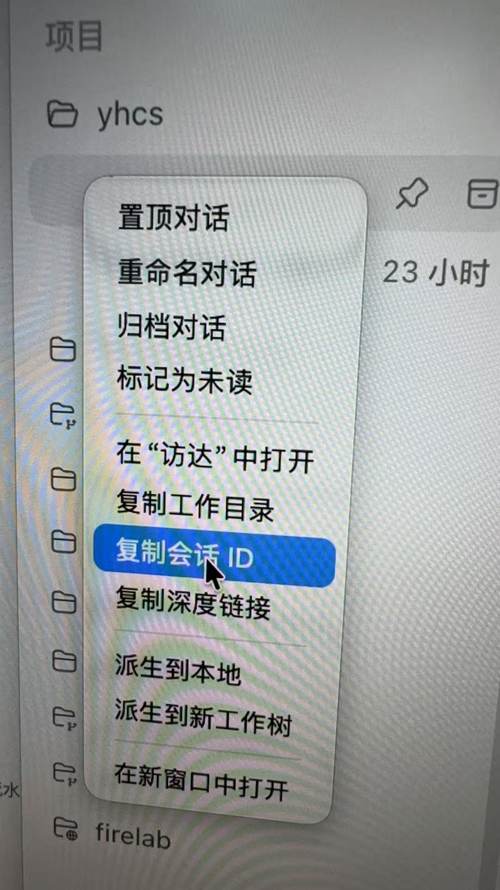

# Codex Session Delete

根据会话 ID 精确查找并彻底删除本地 Codex 对话文件。

Find and permanently delete a local Codex conversation by exact session ID.

## 中文说明

Codex 会把本地对话文件保存在类似下面的目录中：

```text
~/.codex/sessions/YYYY/MM/DD/<session-id>.jsonl
~/.codex/sessions/YYYY/MM/DD/rollout-YYYY-MM-DDTHH-MM-SS-<session-id>.jsonl
```

这个插件提供了一个 Codex 技能和一个本地脚本。你只需要提供会话 ID，它会在 sessions 目录中查找精确匹配的 JSONL 文件，并将其删除。

### 安装

推荐直接告诉 Codex：

```text
安装这个插件 https://github.com/juew/codex-session-delete.git ~/plugins/codex-session-delete
```

Codex 会从 GitHub 拉取插件并安装到本地插件目录。

也可以手动克隆到本地 Codex 插件目录：

```bash
mkdir -p ~/plugins
git clone https://github.com/juew/codex-session-delete.git ~/plugins/codex-session-delete
```

然后重启 Codex，并在插件页面确认 `codex-session-delete` 已安装并启用。

插件目录结构：

```text
codex-session-delete/
  .codex-plugin/plugin.json
  skills/delete-session/SKILL.md
  scripts/delete_codex_session.py
```

### 会话 ID 从哪里来

在 Codex 的会话列表里右键目标对话，然后点击“复制会话 ID”。



### 推荐使用方式

安装并启用插件后，优先直接在 Codex 中这样说：

```text
用 codex-session-delete 删除会话 <session-id>
```

也可以说：

```text
使用 codex-session-delete 插件，删除会话 <session-id>
```

插件会调用内置脚本，按完整会话 ID 精确查找并删除对应的 JSONL 文件。

如果安装后没有立刻生效，重启 Codex，或确认插件页中 `codex-session-delete` 已安装并启用。

如果默认位置没有找到会话，Codex 会提示你是否扩大搜索范围。你可以指定一个工作区目录，例如：

```text
在 ~/Downloads/workspace 中继续查找这个会话
```

### 命令行用法

命令行适合调试、批处理，或在 Codex 插件调用不可用时使用。在插件目录下运行：

```bash
python3 scripts/delete_codex_session.py <session-id>
```

建议先 dry-run 确认要删除的文件：

```bash
python3 scripts/delete_codex_session.py <session-id> --dry-run
```

如果你的 Codex 数据目录不是 `~/.codex`，可以设置 `CODEX_HOME`：

```bash
CODEX_HOME=/path/to/.codex python3 scripts/delete_codex_session.py <session-id>
```

也可以直接指定 sessions 根目录：

```bash
python3 scripts/delete_codex_session.py <session-id> --root /path/to/.codex/sessions
```

如果你不知道具体 sessions 根目录，但知道项目大概在哪个工作区，可以扫描该目录下所有 `.codex/sessions`：

```bash
python3 scripts/delete_codex_session.py <session-id> --scan-from ~/Downloads/workspace
```

### 安全策略

- 只会删除解析后的 sessions 根目录里的文件。
- 使用 `--scan-from` 时，只会删除扫描到的 `.codex/sessions` 目录里的文件。
- 必须精确匹配完整会话 ID，支持 `<session-id>.jsonl` 和 `rollout-...-<session-id>.jsonl`。
- 拒绝包含路径符号的 ID。
- 如果发现多个精确匹配，会停止并报错。
- 不会删除目录。
- 不使用模糊匹配或部分 ID 删除。

如果删除后 Codex 界面里仍显示该对话，重启 Codex 即可刷新。

## English

Codex stores local conversation files in a directory like this:

```text
~/.codex/sessions/YYYY/MM/DD/<session-id>.jsonl
~/.codex/sessions/YYYY/MM/DD/rollout-YYYY-MM-DDTHH-MM-SS-<session-id>.jsonl
```

This plugin provides a Codex skill and a local script. Give it a session ID, and it searches the sessions directory for the exact matching JSONL file, then deletes it.

### Install

Recommended: ask Codex directly:

```text
Install this plugin https://github.com/juew/codex-session-delete.git ~/plugins/codex-session-delete
```

Codex will fetch the plugin from GitHub and install it into your local plugins directory.

You can also clone it manually:

```bash
mkdir -p ~/plugins
git clone https://github.com/juew/codex-session-delete.git ~/plugins/codex-session-delete
```

Then restart Codex and confirm that `codex-session-delete` is installed and enabled in the plugin page.

Expected plugin layout:

```text
codex-session-delete/
  .codex-plugin/plugin.json
  skills/delete-session/SKILL.md
  scripts/delete_codex_session.py
```

### Where To Find The Session ID

In the Codex conversation list, right-click the target conversation and choose "Copy Session ID".


### Recommended Usage

After installing and enabling the plugin, prefer asking Codex directly:

```text
Use codex-session-delete to delete session <session-id>
```

You can also say:

```text
Use the codex-session-delete plugin to delete session <session-id>
```

The plugin will call the bundled script, find the exact matching JSONL file by full session ID, and delete it.

If it does not work immediately after installation, restart Codex or confirm that `codex-session-delete` is installed and enabled in the plugin page.

If the default location does not contain the session, Codex can ask whether to expand the search. You can provide a workspace directory, for example:

```text
Continue searching for this session in ~/Downloads/workspace
```

### Command Line Usage

The command line is useful for debugging, batch cleanup, or as a fallback when plugin invocation is unavailable. From the plugin directory:

```bash
python3 scripts/delete_codex_session.py <session-id>
```

Run a dry-run first to confirm the target file:

```bash
python3 scripts/delete_codex_session.py <session-id> --dry-run
```

If your Codex data directory is not `~/.codex`, set `CODEX_HOME`:

```bash
CODEX_HOME=/path/to/.codex python3 scripts/delete_codex_session.py <session-id>
```

Or pass the sessions root directly:

```bash
python3 scripts/delete_codex_session.py <session-id> --root /path/to/.codex/sessions
```

If you do not know the exact sessions root but know the workspace area, scan all `.codex/sessions` directories under it:

```bash
python3 scripts/delete_codex_session.py <session-id> --scan-from ~/Downloads/workspace
```

### Safety

- Deletes only files under the resolved sessions root.
- With `--scan-from`, deletes only files under discovered `.codex/sessions` directories.
- Requires an exact full session ID match, supporting both `<session-id>.jsonl` and `rollout-...-<session-id>.jsonl`.
- Rejects path-like IDs.
- Stops with an error if more than one exact match is found.
- Does not delete directories.
- Does not use fuzzy matching or partial IDs.

Restart Codex if the deleted conversation still appears in the UI.

## License

MIT
